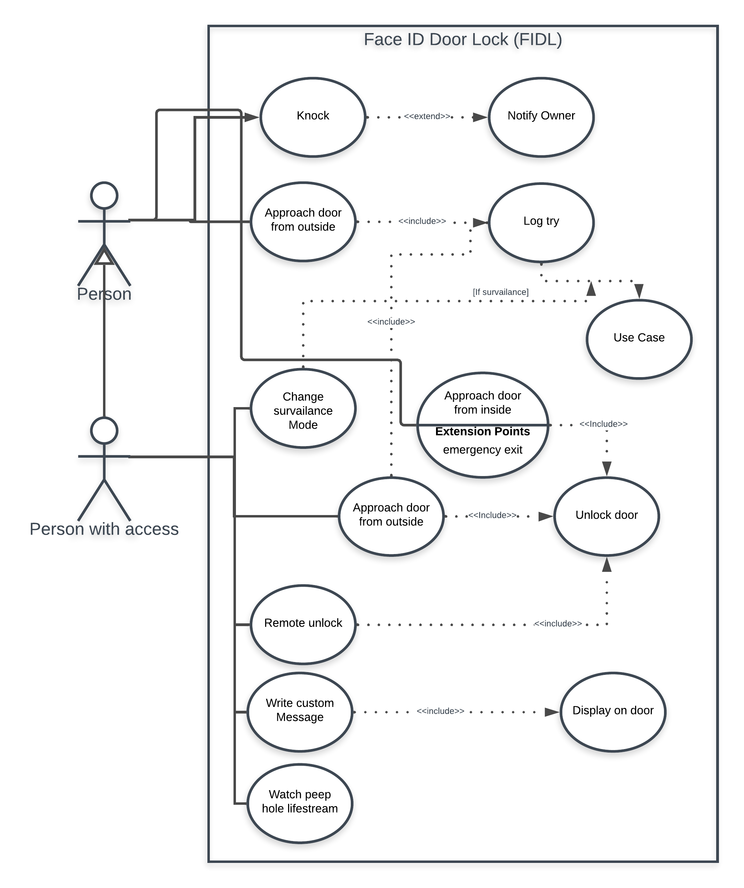

# FIDL
FIDL - Face ID Door lock uses Facial Recognition to unlock the door before you even get to it.
The objective is to make passing through a locked door as easy as possible while sustaining some degree of security.

## Overview
### Use Case

### Activity Diagram

